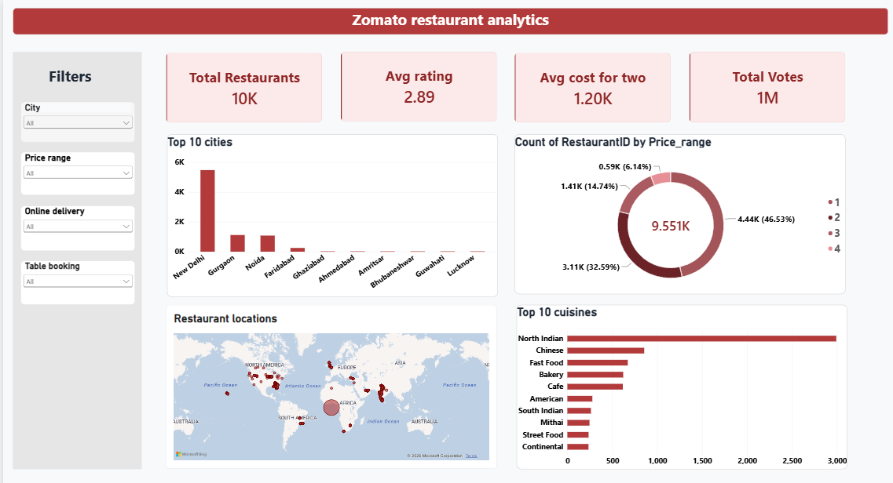

# Zomato Restaurant Analytics Dashboard

A Power BI dashboard for exploring and analyzing restaurant data using interactive filters, KPI cards, charts, a scatter plot, and a geographic map.

The dashboard is designed as a two-page analytical report with a clean light theme and a consistent red visual style.

## Dashboard Preview

### Page 1 — Zomato Restaurant Analytics



### Page 2 — Ratings and Cost Deep Dive


## Project Overview

The Zomato Restaurant Analytics Dashboard provides an interactive view of restaurant information such as:

- Restaurant count
- Average restaurant rating
- Average cost for two
- Total votes
- Top cities by restaurant count
- Price-range distribution
- Restaurant geographic locations
- Top cuisines
- Average rating by price range
- Relationship between votes and ratings
- Average cost across top cities
- Online delivery availability
- Table booking availability

The dashboard contains two pages so that high-level restaurant information and deeper rating/cost analysis can be viewed separately.

## Dashboard Pages

### Page 1 — Zomato Restaurant Analytics

The first page provides an overview of the restaurant dataset.

**KPI Cards**
- Total Restaurants
- Avg Rating
- Avg Cost for Two
- Total Votes

**Visuals**
- Top 10 Cities
- Price Range Split
- Restaurant Locations Map
- Top 10 Cuisines

**Filters**
- City
- Price Range
- Online Delivery
- Table Booking

### Page 2 — Ratings and Cost Deep Dive

The second page focuses on restaurant ratings, votes, delivery/booking availability, and cost.

**KPI Cards**
- Avg Votes / Restaurant
- Online Delivery %
- Table Booking %

**Visuals**
- Avg Rating by Price Range
- Votes vs Rating Scatter Plot
- Avg Cost by Top 10 Cities

The filters are synchronized between the two pages.

## Key Metrics

The dashboard uses Power BI measures to calculate metrics dynamically based on the selected filters.

Examples include:

- Total number of restaurants
- Average rating
- Average cost for two
- Total votes
- Average votes per restaurant
- Percentage of restaurants offering online delivery
- Percentage of restaurants offering table booking

Because the calculations are dynamic, KPI values and chart results can change when users interact with the filters.

## Dataset

The dashboard was created using a restaurant dataset containing fields such as:

- RestaurantID
- City
- Cuisines
- Price_range
- Has_Online_delivery
- Has_Table_booking
- Votes
- Average_Cost_for_two
- Rating
- Latitude
- Longitude
- Currency

**Dataset source:** Add the original dataset/source link here if required by your college, assignment, or dataset license.

> Note: The dataset contains restaurant records from multiple locations/countries and currencies. The dashboard therefore uses the available dataset values and applies appropriate filtering where required for cost analysis.

## Tools and Technologies

- **Microsoft Power BI Desktop** — dashboard creation, visualization and interactive analysis
- **Microsoft Excel** — source dataset
- **Power Query** — data loading and preparation
- **DAX** — calculated measures and KPI calculations

## Power BI Concepts Used

This project demonstrates the use of:

- KPI/Card visuals
- Slicers
- Clustered column/bar charts
- Donut charts
- Scatter plots
- Map visualization
- Top N filters
- Visual-level filters
- Synchronized slicers
- DAX measures
- Aggregations such as Count, Sum and Average
- Data formatting
- Dashboard layout and visual design

## Important Measures

Examples of the measures used in the dashboard include:

```DAX
Total Restaurants =
DISTINCTCOUNT('Sheet1'[RestaurantID])
```

```DAX
Avg Rating =
AVERAGE('Sheet1'[Rating])
```

```DAX
Avg Cost =
AVERAGE('Sheet1'[Average_Cost_for_two])
```

```DAX
Total Votes =
SUM('Sheet1'[Votes])
```

```DAX
Avg Votes per Restaurant =
AVERAGE('Sheet1'[Votes])
```

```DAX
Online Delivery % =
DIVIDE(
    CALCULATE(
        DISTINCTCOUNT('Sheet1'[RestaurantID]),
        'Sheet1'[Has_Online_delivery] = "Yes"
    ),
    DISTINCTCOUNT('Sheet1'[RestaurantID])
)
```

```DAX
Table Booking % =
DIVIDE(
    CALCULATE(
        DISTINCTCOUNT('Sheet1'[RestaurantID]),
        'Sheet1'[Has_Table_booking] = "Yes"
    ),
    DISTINCTCOUNT('Sheet1'[RestaurantID])
)
```

## Dashboard Design

The dashboard follows a light, minimal visual design.

### Main Colors

| Element | Color |
|---|---|
| Header / primary red | `#B23A3A` |
| Dark red text | `#8F2525` |
| KPI card background | `#FCEAEA` |
| KPI card border | `#F1CACA` |
| Page background | `#F7F8FA` |
| Visual background | `#FFFFFF` |
| Main text | `#1F2937` |

The dashboard intentionally uses a consistent red color family instead of using different colors for different KPI cards.

## How to Use

1. Download or clone this repository.
2. Open the `.pbix` file using **Power BI Desktop**.
3. If Power BI asks for the dataset location, update the Excel file path in the data source settings.
4. Refresh the data if required.
5. Use the slicers on the left side to filter the dashboard.
6. Navigate between the two report pages using the tabs at the bottom.
7. Hover over charts and data points to view additional information.

## Repository Structure

```text
Zomato-Restaurant-Analytics-Dashboard/
│
├── README.md
│
├── Zomato-Restaurant-Analytics.pbix
│
├── data/
│   └── restaurant_data.xlsx
│
└── screenshots/
    ├── page-1-dashboard.png
    └── page-2-dashboard.png
```

## Notes

- The `.pbix` file is the main Power BI project file.
- The Excel file is the source dataset, if redistribution is permitted by its source/license.
- If the dataset is not legally redistributable, keep it out of the public repository and document the original source instead.
- If the `.pbix` file is too large for normal GitHub browser upload, use Git from the command line or Git LFS as appropriate.

## Future Improvements

Possible future additions include:

- More detailed cuisine analysis
- Restaurant-level drill-through pages
- Additional geographic analysis
- Time-based analysis if historical data becomes available
- Additional comparison measures
- More advanced DAX calculations

## Author

**Shalini Nadar**

BSc Data Science Student

Mumbai, India

---

## Project Type

**Data Analytics | Business Intelligence | Power BI | Data Visualization**
